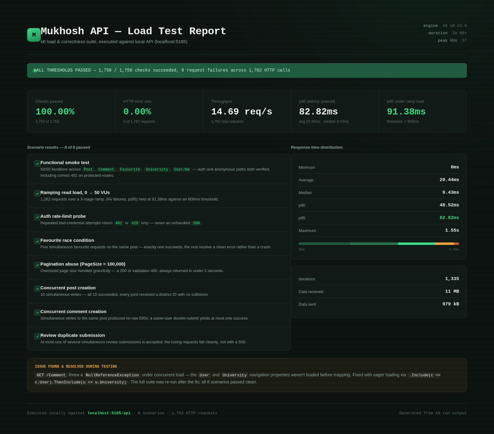

# Mukhosh

**Mukhosh (মুখোশ, meaning "mask" in Bengali)** is a university experience and review platform built for Bangladeshi students.

University websites and admission materials provide official information, but they often don't capture what everyday student life is actually like. Mukhosh is designed to give students a place to share and discover experiences about universities — including academics, campus environment, food, research facilities, extracurricular activities, and more.

The platform supports university reviews, student posts, comments, favourites, university discovery, verified university identities, and administrative moderation.

---
## Production Deployment

Mukhosh started as a local full-stack project and was eventually deployed as a complete production application.

The **Angular 18 frontend** is hosted on **Vercel**, while the **ASP.NET Core .NET 8 Web API** is containerized with Docker and deployed on **Render**. The local SQL Server database was migrated to **Azure SQL Database** for production, with the backend connecting to it through Entity Framework Core.

For email verification and password reset emails, the original Gmail SMTP setup could not be used from Render's free environment because of its SMTP port restrictions. The email system was therefore moved to **Sendlib**, which uses the connected Gmail account through its API without requiring a custom domain.

All production secrets, database credentials, JWT configuration, frontend URL, and Sendlib API credentials are stored as environment variables rather than committed to the repository.

**Live:** https://mukhosh-beta.vercel.app/

---

## Features

### Authentication & Authorization

* User registration and login
* JWT-based authentication
* ASP.NET Core Identity
* Email verification
* Password reset through email
* Role-based authorization
* `User` and `Admin` roles
* Protected API endpoints
* Separate email verification and university verification
* University affiliation determined through verified university email domains
* Banned-user enforcement

### University Verification

Mukhosh distinguishes between:

* **Email verified** — the user's email address has been verified
* **University verified** — the user has a verified university email/domain

Regular users can create accounts and browse the platform, while university-affiliated users can be verified against their university email domain.

This allows Mukhosh to distinguish verified university students from general users.

### Posts

* Create posts
* View posts
* View individual posts
* Update posts
* Delete posts
* Pagination
* Positive / Negative / Mixed post vibes
* User ownership
* University-affiliated posting restrictions

### Comments

* Create comments
* View comments
* Update comments
* Delete comments
* Associate comments with users and posts
* User ownership checks

### Favourites

* Favourite posts
* Remove favourites
* Prevent duplicate favourites
* View a user's favourite posts

### University Reviews

Users can review universities across multiple categories:

* Environment
* Faculty
* Research Facilities
* Education Quality
* Academic Pressure
* Canteen Food
* Administration
* Extracurricular Activities

Each category is rated out of **5**.

The review system also supports:

* One review per user per university
* Database-level uniqueness
* Written reviews
* Per-category average ratings
* Overall university rating statistics
* Total review counts

### University Discovery

* Browse universities
* View individual university information
* Search/filter universities
* View aggregated review statistics
* Admin-controlled university creation

### User Profiles

Users can manage profile information including:

* First name
* Last name
* Username
* Phone number

University information is associated with verified university email domains rather than being freely selected during registration.

### Admin System

The application includes an administrative area for managing the platform.

Admin functionality includes:

* Dashboard statistics
* User management
* User details
* User banning
* Temporary bans
* Permanent bans
* University management
* Protected admin-only endpoints

Permanent bans preserve the user account while removing the user's platform activities/content, preventing the banned account from simply being recreated.

---

# Tech Stack

## Backend

| Technology            | Purpose              |
| --------------------- | -------------------- |
| C#                    | Programming language |
| ASP.NET Core Web API  | Backend framework    |
| .NET 8                | Runtime / SDK        |
| Entity Framework Core | ORM                  |
| Microsoft SQL Server  | Database             |
| ASP.NET Core Identity | User management      |
| JWT                   | Authentication       |
| Swagger / OpenAPI     | API documentation    |
| MailKit               | Email functionality  |

## Frontend

| Technology         | Purpose             |
| ------------------ | ------------------- |
| Angular 18         | Frontend framework  |
| TypeScript         | Frontend language   |
| HTML / CSS         | UI                  |
| Angular Router     | Client-side routing |
| Angular HttpClient | API communication   |

## Development Tools

* Visual Studio / VS Code
* SQL Server Management Studio
* Postman
* Git
* GitHub

---

# Architecture

Mukhosh uses a layered backend architecture.

```text
                    ┌─────────────────┐
                    │     Angular     │
                    │    Frontend     │
                    └────────┬────────┘
                             │
                             │ HTTP / JSON
                             ▼
                    ┌─────────────────┐
                    │   Controllers   │
                    └────────┬────────┘
                             │
                             ▼
                    ┌─────────────────┐
                    │      DTOs       │
                    └────────┬────────┘
                             │
                             ▼
                    ┌─────────────────┐
                    │     Mappers     │
                    └────────┬────────┘
                             │
                             ▼
                    ┌─────────────────┐
                    │   Repositories  │
                    └────────┬────────┘
                             │
                             ▼
                    ┌─────────────────┐
                    │    DbContext    │
                    │  EntityFramework│
                    └────────┬────────┘
                             │
                             ▼
                    ┌─────────────────┐
                    │  SQL Server DB  │
                    └─────────────────┘
```

### Backend responsibilities

**Controllers**

Handle HTTP requests, routing, validation, authentication and authorization.

**DTOs**

Define request and response structures so database entities are not directly exposed through the API.

**Mappers**

Convert between DTOs and database entities.

**Repositories**

Handle database operations through Entity Framework Core.

**Models**

Represent database entities and relationships.

**DbContext**

Manages Entity Framework Core configuration, relationships and database access.

**Services**

Contain reusable application logic such as JWT token generation and email delivery.

**Middleware**

Handles application-wide behavior such as banned-user enforcement.

---

# Project Structure

```text
Mukhosh/
│
├── api/
│   │
│   ├── Controllers/
│   │   ├── AdminController.cs
│   │   ├── AuthController.cs
│   │   ├── CommentController.cs
│   │   ├── FavouriteController.cs
│   │   ├── PostController.cs
│   │   ├── ReviewController.cs
│   │   ├── UniversityController.cs
│   │   └── UserController.cs
│   │
│   ├── DTOs/
│   │   ├── Admin/
│   │   ├── Comment/
│   │   ├── Favourite/
│   │   ├── Post/
│   │   ├── Review/
│   │   ├── University/
│   │   └── User/
│   │
│   ├── Database/
│   │   └── ApplicationDBContext.cs
│   │
│   ├── Helper/
│   │
│   ├── Interfaces/
│   │
│   ├── Mappers/
│   │
│   ├── Middleware/
│   │   └── BanEnforcementMiddleware.cs
│   │
│   ├── Models/
│   │
│   ├── Repository/
│   │
│   ├── Service/
│   │   ├── EmailService.cs
│   │   └── TokenService.cs
│   │
│   ├── Migrations/
│   │
│   ├── Program.cs
│   ├── api.csproj
│   └── api.http
│
├── frontend/
│   │
│   ├── public/
│   │
│   ├── src/
│   │   ├── app/
│   │   │   ├── admin-dashboard/
│   │   │   ├── admin-users/
│   │   │   ├── admin-user-details/
│   │   │   ├── login/
│   │   │   ├── navbar/
│   │   │   ├── post-create/
│   │   │   ├── post-detail/
│   │   │   ├── post-list/
│   │   │   ├── profile/
│   │   │   ├── register/
│   │   │   ├── university-create/
│   │   │   ├── university-detail/
│   │   │   ├── university-list/
│   │   │   ├── my-favourites/
│   │   │   ├── pages/
│   │   │   ├── core/
│   │   │   ├── models/
│   │   │   └── services/
│   │   │
│   │   ├── environments/
│   │   ├── index.html
│   │   ├── main.ts
│   │   └── styles.css
│   │
│   ├── angular.json
│   ├── package.json
│   ├── package-lock.json
│   └── tsconfig.json
│
├── .gitignore
└── README.md
```

---

# Database

Mukhosh uses **Microsoft SQL Server** with **Entity Framework Core**.

The primary application entities include:

```text
User
 │
 ├── Posts
 │    │
 │    ├── Comments
 │    │
 │    └── Favourites
 │
 └── Reviews
       │
       └── University
```

Additional Identity tables are created by ASP.NET Core Identity for authentication and role management.

Entity Framework Core migrations are used to manage database schema changes.

---

# Getting Started

## Prerequisites

Install the following before running Mukhosh:

* [.NET 8 SDK](https://dotnet.microsoft.com/download/dotnet/8.0)
* Node.js
* npm
* Angular CLI
* Microsoft SQL Server
* SQL Server Management Studio or another SQL client
* Git

Postman is optional because the API can also be tested through Swagger.

---

# Backend Setup

Open a terminal in the project root.

```bash
cd api
```

Restore the .NET dependencies:

```bash
dotnet restore
```

---

## Configure Secrets

Mukhosh requires configuration values that should **not** be committed to GitHub.

These include:

* SQL Server connection string
* JWT signing key
* Email credentials

.NET User Secrets can be used during local development.

Initialize User Secrets:

```bash
dotnet user-secrets init
```

Configure the database:

```bash
dotnet user-secrets set "ConnectionStrings:DefaultConnection" "YOUR_CONNECTION_STRING"
```

Configure the JWT signing key:

```bash
dotnet user-secrets set "JWT:SigningKey" "YOUR_RANDOM_SECRET_KEY"
```

Configure email settings according to the configuration used by the application.

**Never commit real passwords, API keys, JWT signing keys, database credentials or email credentials to GitHub.**

---

# Database Setup

After configuring the connection string, apply the Entity Framework Core migrations:

```bash
dotnet ef database update
```

If Entity Framework CLI is not installed:

```bash
dotnet tool install --global dotnet-ef
```

Verify:

```bash
dotnet ef --version
```

---

# Run the Backend

From the `api` directory:

```bash
dotnet run
```

For development with automatic reload:

```bash
dotnet watch run
```

The API URL depends on the configured launch profile.

For the default local development configuration:

```text
http://localhost:5185
```

Swagger:

```text
http://localhost:5185/swagger
```

---

# Frontend Setup

Open a second terminal.

From the project root:

```bash
cd frontend
```

Install Angular dependencies:

```bash
npm install
```

Start the development server:

```bash
npm start
```

The Angular application will normally be available at:

```text
http://localhost:4200
```

The frontend communicates with the ASP.NET Core API through the configured API URL in the Angular environment configuration.

---

# Running the Full Application

You need both the backend and frontend running.

### Terminal 1 — Backend

```bash
cd api
dotnet run
```

### Terminal 2 — Frontend

```bash
cd frontend
npm start
```

Then open:

```text
http://localhost:4200
```

The Angular frontend communicates with the API running on the configured backend URL.

---

# Authentication Flow

Mukhosh uses JWT authentication.

The general authentication flow is:

```text
Register
   │
   ▼
Email Verification
   │
   ▼
Login
   │
   ▼
JWT Token
   │
   ▼
Authenticated API Requests
```

Authenticated requests use:

```http
Authorization: Bearer YOUR_JWT_TOKEN
```

Admin endpoints additionally require the `Admin` role.

---

# API

The backend exposes RESTful endpoints for the application's main resources.

| Resource       | Operations                                    |
| -------------- | --------------------------------------------- |
| Authentication | Register, Login, Verify Email, Password Reset |
| Users          | View / Update Profile                         |
| Posts          | Create, Read, Update, Delete                  |
| Comments       | Create, Read, Update, Delete                  |
| Favourites     | Add, Remove, List                             |
| Universities   | Create, Read, Search                          |
| Reviews        | Create, Read, Update                          |
| Administration | Dashboard, Users, Ban Management              |

Swagger provides the complete list of available endpoints, request models and response models.

---

# API Testing

## Swagger

With the backend running, open:

```text
http://localhost:5185/swagger
```

Swagger can be used to:

* Explore endpoints
* Inspect request/response models
* Test API endpoints
* Test authenticated endpoints
* Inspect the generated OpenAPI specification

## Postman

The OpenAPI specification can be imported into Postman:

```text
http://localhost:5185/swagger/v1/swagger.json
```

Postman is optional and is not required to run the application.

---
## Load Testing

The API was tested using [k6](https://k6.io) across 8 scenarios covering functional correctness, performance, security controls, and concurrency behavior.

Test coverage included:

- Functional smoke testing across core endpoints:
  - Posts
  - Comments
  - Favourites
  - Universities
  - User profile
- Ramping load test (0 → 50 concurrent users)
- Authentication rate-limit testing
- Favourite race-condition testing
- Pagination abuse testing
- Concurrent post creation testing
- Concurrent comment creation testing
- Review duplicate submission testing

## Results

✅ **1,750 / 1,750 checks passed**  
✅ **0.00% HTTP error rate**  
✅ **50 concurrent users handled successfully**  
✅ **No unhandled 500 errors under load**

Performance:

- Average response time: **20.44ms**
- p(95) response time: **82.82ms**
- p(95) under ramping load: **91.38ms**
- Throughput: **~14.7 requests/second**

## Issues Found and Fixed

During initial load testing, a real production-level issue was discovered:

- `GET /Comment` endpoint crashed with a `NullReferenceException` under load because related `User` and `University` navigation properties were not loaded before mapping.

Fix:

- Added required Entity Framework Core eager loading using:
  - `.Include(c => c.User)`
  - `.ThenInclude(u => u.University)`

After applying the fix, the complete load test suite was executed again and all scenarios passed successfully.


---


# Database Changes

When the application's Entity Framework models change, create a new migration.

From the `api` directory:

```bash
dotnet ef migrations add MigrationName
```

Then apply it:

```bash
dotnet ef database update
```

Example:

```bash
dotnet ef migrations add AddNewFeature
dotnet ef database update
```

Migrations should be committed to the repository so another environment can recreate the database schema.

---

# Environment Configuration

The repository intentionally excludes sensitive and machine-specific configuration.

Examples of values that should remain outside Git:

```text
Database connection strings
JWT signing keys
Email passwords
SMTP credentials
Production secrets
Local development configuration
```

For local development, use:

```text
.NET User Secrets
```

For production deployment, use the hosting provider's environment-variable/secret-management system.

---

# Deployment

Mukhosh consists of three major parts:

```text
Angular Frontend
       │
       │ HTTPS
       ▼
ASP.NET Core API
       │
       │ Database Connection
       ▼
Production SQL Server
```

The frontend, API and database can be deployed independently.

Production configuration should use environment-specific settings and secrets rather than committing production credentials to the repository.

---

# Security Considerations

Mukhosh uses several security mechanisms, including:

* JWT authentication
* ASP.NET Core Identity
* Role-based authorization
* Protected API endpoints
* Email verification
* University-domain verification
* User ownership checks
* Admin-only operations
* Banned-user enforcement
* Database constraints for unique relationships
* Secret configuration outside source control

Before production deployment, review:

* CORS configuration
* JWT signing key
* Database credentials
* Email credentials
* HTTPS configuration
* Production environment variables
* Rate limiting
* Error handling
* Logging
* Database backups
* Dependency vulnerabilities

---

# Current Project Status

### Backend

* [x] ASP.NET Core Web API
* [x] .NET 8
* [x] Entity Framework Core
* [x] SQL Server integration
* [x] ASP.NET Core Identity
* [x] JWT authentication
* [x] Email verification
* [x] Password reset
* [x] Role-based authorization
* [x] User management
* [x] Post CRUD
* [x] Comments
* [x] Favourites
* [x] University management
* [x] University reviews
* [x] University verification
* [x] Admin dashboard
* [x] User banning
* [x] Swagger / OpenAPI
* [x] Entity Framework Core migrations

### Frontend

* [x] Angular application
* [x] Authentication UI
* [x] Registration
* [x] Login
* [x] Email verification
* [x] Password reset
* [x] User profile
* [x] Post feed
* [x] Post creation
* [x] Post details
* [x] Comments
* [x] Favourites
* [x] University browsing
* [x] University details
* [x] University reviews
* [x] Admin dashboard
* [x] Admin user management
* [x] Authentication guards
* [x] HTTP authentication interceptor

---

# Future Improvements

Potential future improvements include:

* Production deployment
* Automated CI/CD
* Improved search and filtering
* More university statistics
* Richer student profiles
* University-specific Q&A / "Ask a Boro Bhai"
* Notification system
* Improved moderation and reporting
* Automated database backups
* Production monitoring and logging
* Performance optimization

---

# What I Learned

Mukhosh was built as a practical full-stack project to gain experience with the ASP.NET and Angular ecosystems.

The project covers:

* C#
* ASP.NET Core Web API
* REST API design
* Entity Framework Core
* SQL Server
* Entity relationships and foreign keys
* Database migrations
* DTO-based API design
* Repository pattern
* Dependency injection
* ASP.NET Core Identity
* JWT authentication
* Role-based authorization
* Email-based authentication flows
* Angular
* TypeScript
* Angular routing
* HTTP interceptors
* Authentication guards
* Frontend/backend integration
* API testing with Swagger and Postman
* Git and GitHub

---

# License

This project currently does not have a separate open-source license.
